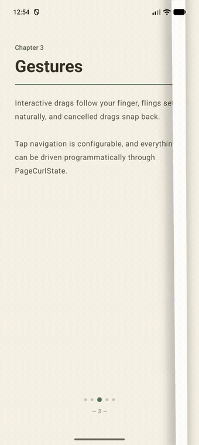
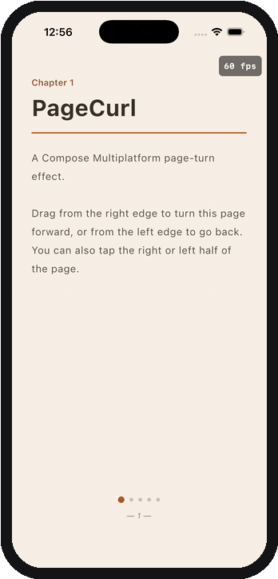

# PageCurl for Compose Multiplatform

[](https://central.sonatype.com/artifact/io.github.zeyad-37/pagecurl-cmp)

Page curl (page turn) effect for **Compose Multiplatform** — Android and iOS from one Kotlin codebase.

This is a multiplatform fork of [oleksandrbalan/pagecurl](https://github.com/oleksandrbalan/pagecurl)
(Apache-2.0). The original library is Android-only; this fork moves all gesture, state and
curl-geometry code to `commonMain` and keeps only the page-edge shadow platform-specific
(`expect fun CacheDrawScope.prepareCurlPageShadow`): Android uses the original native blur
(`Paint.setShadowLayer`, with upstream's software-bitmap fallback below API 28); iOS uses a Skia blur `MaskFilter` with the same radius→sigma model, so shadow parameters render equivalently on both platforms.

## Motivation

Create an effect of turning pages, which can be used in book reader applications, custom
on-boarding screens or elsewhere — on both mobile platforms, with identical behavior.

## Platforms

| Target | Status |
|---|---|
| Android (`minSdk 21`) | ✅ Same behavior as upstream, native blur shadow |
| iOS (`iosArm64`, `iosSimulatorArm64`) | ✅ Verified on device at a steady 60 fps |

## Demo

| Android | iOS |
|---|---|
|  |  |

Both recordings are the sample app in this repo — same `commonMain` composable on both platforms.

## Usage

### Get a dependency

Available on [Maven Central](https://central.sonatype.com/artifact/io.github.zeyad-37/pagecurl-cmp):

```kotlin
kotlin {
    sourceSets {
        commonMain.dependencies {
            implementation("io.github.zeyad-37:pagecurl-cmp:2.1.0")
        }
    }
}
```

> Note: the classes live in the `com.zeyadgasser.pagecurl` package (renamed from upstream's
> `eu.wewox.pagecurl` so both libraries can coexist on an Android classpath).

### Use in Compose

Provide a count of pages and content for each page, exactly like the upstream API:

```kotlin
@OptIn(ExperimentalPageCurlApi::class)
@Composable
fun Book(pages: List<String>) {
    PageCurl(count = pages.size) { index ->
        Text(pages[index])
    }
}
```

Drag from the right edge to turn a page forward, from the left edge to go back; taps on the
right / left half work too. Use `rememberPageCurlState()` to observe or drive the current page
programmatically, and `rememberPageCurlConfig()` to configure shadow color / alpha / radius /
offset, back-page color, and drag & tap interaction zones.

## Samples

The `sample/` directory contains one shared demo UI (`sample/shared`, plain `commonMain`
Compose) consumed by both platform apps — including an on-screen FPS readout, useful when
judging curl smoothness on a real device:

- **Android**: `./gradlew :sample:androidApp:installDebug`
- **iOS**: open `sample/iosApp/iosApp.xcodeproj` in Xcode and run. The project is generated
  from `project.yml` with [XcodeGen](https://github.com/yonaskolb/XcodeGen); the generated
  `.xcodeproj` is committed, so XcodeGen is only needed if you change `project.yml`.

The legacy Android-only `demo/` module from upstream has been removed — the multiplatform
sample replaces it.

## Versioning

Forked from upstream `v1.5.1`. This fork starts at `2.0.0` to signal the package rename and
the multiplatform conversion; it is not binary-compatible with `io.github.oleksandrbalan:pagecurl`.

## Credits

All of the curl mathematics, gesture handling and API design come from
[Oleksandr Balan](https://github.com/oleksandrbalan)'s excellent
[pagecurl](https://github.com/oleksandrbalan/pagecurl) library. This fork only ports it to
Compose Multiplatform.

## License

This project is licensed under the **[MIT License](LICENSE)** (Copyright © 2026 Zeyad Gasser).

It is a derivative work of [oleksandrbalan/pagecurl](https://github.com/oleksandrbalan/pagecurl)
(Copyright 2022 Oleksandr Balan, Apache License 2.0). Apache-2.0 §4 permits licensing a
derivative work as a whole under different terms; its conditions are honored here — the upstream
license text is retained in [LICENSE-upstream-APACHE-2.0](LICENSE-upstream-APACHE-2.0), the
[NOTICE](NOTICE) file carries the attribution, and modified files carry change notices in their
headers.
